<h1 style="text-align: center;"> Developing a Speech Recognition Model Using Convolutional Neural Networks (10 minute read) </h1>

Credit: <a href="https://getvoip.com/blog/2021/03/08/what-is-ivr/"> What is IVR And How Does it Work? (Plus Top IVR Providers) </a> 

This repository expands on the liveProject [Recognize Speech Commands with Deep Learning](https://www.manning.com/liveproject/recognize-speech-commands-with-deep-learning) by [Manning Publications](https://liveproject.manning.com/), for which I served as the Implementer.

If you prefer diving into the code straight away, please click on [dl-for-speech-recognition.ipynb](https://github.com/koushikvikram/speech-recognition-deep-learning/blob/main/dl-for-speech-recognition.ipynb).

## Introduction

When you dial your Bank's customer service, instead of a human picking up your call, a computer answers and asks you to speak out your account number. You tell your account number. Then, the computer gives you a few options, asks you for more details and transfers your call to a human according to your response. This process is called Interactive Voice Response (IVR). But, have you ever wondered how the computer is actually able to understand what you said?

Enter ASR. IVR uses a technology called Automatic Speech Recognition or ASR, also known as Speech-to-Text (STT) to understand your speech. ASR takes in the audio, converts it to text and passes it on for the computer to make a decision. 

> *"ASR is widely used in contact centres across the globe to enhance customer satisfaction, cutting costs, improving productivity and so on. It is now extremely easy for callers to input different types of information including reason of calling, account numbers, names via the capabilities of a voice recognition technology. All these can be done without any interaction with a live call centre agent. It impacts tremendously on the productivity of contact centre as callers need not have to remain idle while their calls are put on hold since agents are busy with some other calls. This is how a contact centre can do great cost cutting by making effective use of speech recognition technology."* - Speech Recognition And Customer Experience, Sumita Banerjee [[1](https://www.c-zentrix.com/blog/speech-recognition-and-customer-experience)]

Some speech recognition systems require "training" (also called "enrollment") where an individual speaker reads text or isolated vocabulary into the system. The system analyzes the person's specific voice and uses it to fine-tune the recognition of that person's speech, resulting in increased accuracy. Systems that do not use training are called "speaker-independent" systems. Systems that use training are called "speaker dependent". [[2](https://en.wikipedia.org/wiki/Speech_recognition)]

## Contents
- [Dataset and Project Outline](https://github.com/koushikvikram/speech-recognition-deep-learning#dataset-and-project-outline)
- [Signal Processing Concepts](https://github.com/koushikvikram/speech-recognition-deep-learning#signal-processing-concepts)
- [Code](https://github.com/koushikvikram/speech-recognition-deep-learning#code)
- [Moving Forward](https://github.com/koushikvikram/speech-recognition-deep-learning#moving-forward)
- [Conclusion](https://github.com/koushikvikram/speech-recognition-deep-learning#conclusion)
- [Acknowledgment](https://github.com/koushikvikram/speech-recognition-deep-learning#acknowledgment)

## Dataset and Project Outline

In this project, we'll build a "speaker-independent" system and train it on Google Brain's [Speech Commands Data Set v0.01](https://www.kaggle.com/c/tensorflow-speech-recognition-challenge/data). [[3](https://www.kaggle.com/c/tensorflow-speech-recognition-challenge/data)]. Then, we'll test our model on a phone number spoken in our voice. We'll do all of these in a [Kaggle notebook](https://github.com/koushikvikram/speech-recognition-deep-learning/blob/main/dl-for-speech-recognition.ipynb) to take advantage of easy data access and the computing power of GPUs.

## Signal Processing Concepts

We've used quite a few signal processing techniques in our repository. Let's take a look at them before we start.

**Click on each topic to expand.**

 Sample Rate 

Sound, by nature is "Analog". We hear analog sounds as smooth, continuous wave of air pressure pulses (vibrations). However, Computers are highly effective at processing digital data. So, we can convert certain characteristics of an analog sound wave, like the frequency and amplitude to digital data that computer software can read. This allows us to manage, edit, and arrange audio in a software-based context.

The analog sound wave is converted into digital data through a series of snapshot measurements, or samples. A sample is taken at a particular time in the audio wave, recording amplitude. This information is then converted into digestible, binary data. The system makes thousands of measurements per second. If we can take tons of measurements extremely quickly with enough possible amplitude values, we can effectively use these snapshots to reconstruct the resolution and complexity of an analog wave.

| 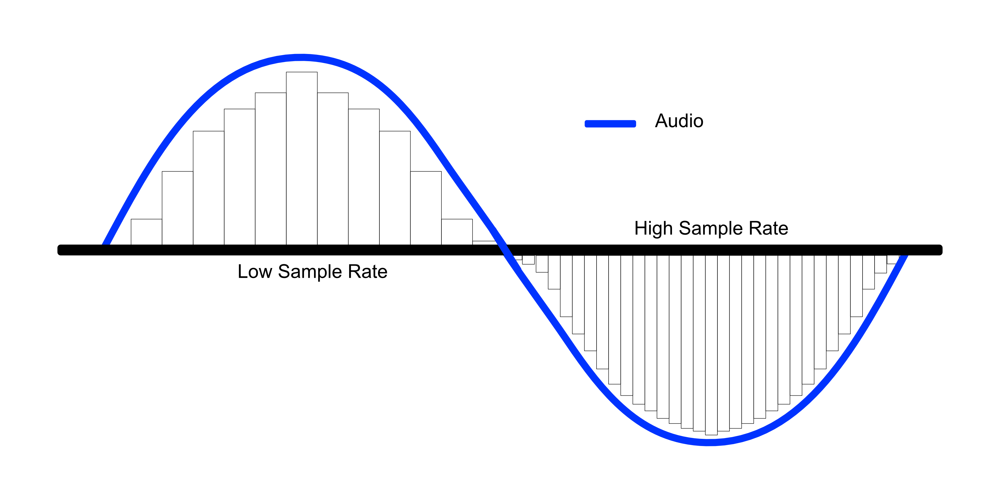 |
|:--:|
| *Credit: https://www.masteringthemix.com/blogs/learn/113159685-sample-rates-and-bit-depth-in-a-nutshell*  |
| |

The system takes these measurements at a speed called the **sample rate**, measured in kilohertz. The sample rate determines the range of frequencies captured in digital audio. The most common sample rate you’ll see is **44.1 kHz, or 44,100 samples per second**. The reason for this is that humans can hear frequencies between 20 Hz and 20 kHz and **Nyquist Theorem** states that "A periodic signal must be sampled at more than twice the highest frequency component of the signal."[[4](https://www.sciencedirect.com/topics/engineering/nyquist-theorem#:~:text=Nyquist's%20theorem%20states%20that%20a,higher%20than%20this%20is%20necessary.)] So, a sampling rate of 40 kHz should be sufficient, right? Theoretically yes, but in practice, because of the finite time available, a sample rate somewhat higher than this is necessary. [[5](https://www.izotope.com/en/learn/digital-audio-basics-sample-rate-and-bit-depth.html)]

> As for our project, we need to make sure that all input files have the same sample rate and duration so that they all have the same shape. This is necessary because our Convolution Neural Network requires all inputs to be of the same shape.

 Envelope 

The envelope of an oscillating signal is a smooth curve outlining its extremes.

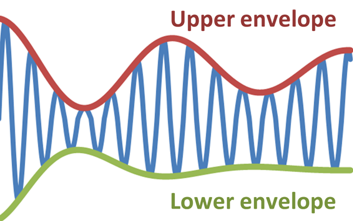

Fast Fourier Transform

> The Fourier Transform and its related concepts are beautifully explained on [thefouriertransform.com](https://www.thefouriertransform.com/). If you'd like to develop a detailed understanding of the concepts, please head over to the website. Here, we'll give a brief overview of each concept to get a basic understanding.

The Fourier Transform is used to decompose complex periodic sound into a sum of sine waves oscillating at different frequencies.

| 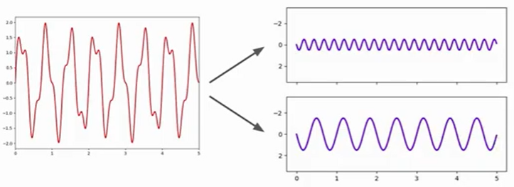 |
|:--:|
| *Credit: https://www.youtube.com/watch?v=m3XbqfIij_Y* |

The Fourier Transform of a function g(t) is defined by:

| 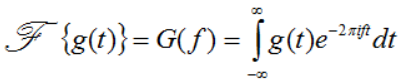 |
|:--:|
| *Credit: https://www.thefouriertransform.com/transform/fourier.php* |

It can be applied to both continuous and discrete waves. Since computers handle discrete waves better, we'll focus on the Discrete Fourier Transform. 

| 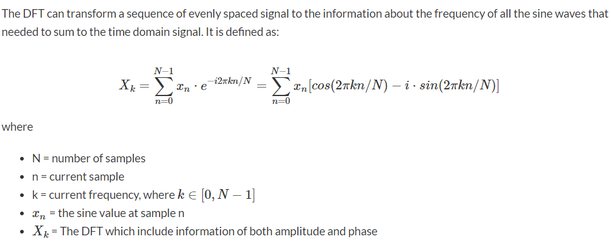 |
|:--:|
| *Credit: https://pythonnumericalmethods.berkeley.edu/notebooks/chapter24.02-Discrete-Fourier-Transform.html* |

Notice how we use summation instead of integration in this formula. This is because we're dealing with discrete waves.

The Discrete Fourier Transform is great. However, it has a time complexity of **O(N^2)** and that's a massive problem when dealing with lengthy signals!

To overcome this problem, we can use the Fast Fourier Transform (FFT), which has a significantly better time complexity of **O(n log n)**. The primary version of the FFT is one due to Cooley and Tukey. The basic idea of it is easy to see.

| 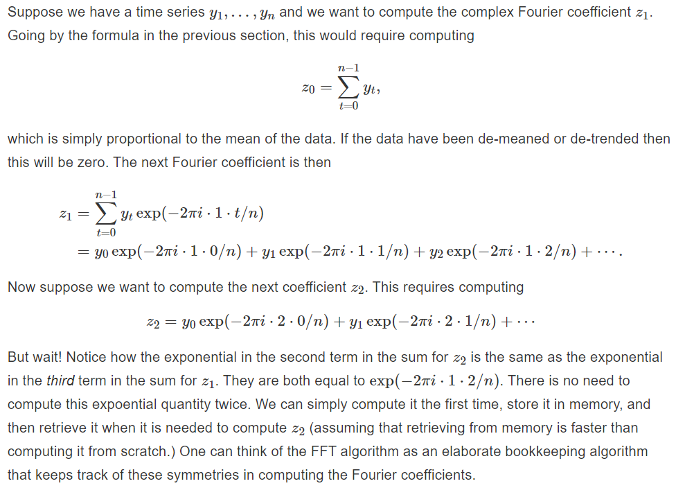 |
|:--:|
| *Credit: https://bookdown.org/rdpeng/timeseriesbook/the-fast-fourier-transform-fft.html* |

Power Spectrum

The result of a Fourier transform is a power spectrum. It represents magnitude as a function of frequency. It's a snapshot of all the elements that concur to form the sound/signal in the given period of time.

| 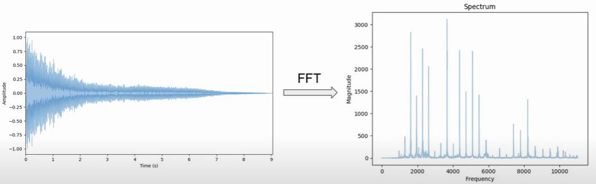 |
|:--:|
| *Credit: https://www.youtube.com/watch?v=m3XbqfIij_Y* |

 Spectrogram and STFT 

Now, we have a power spectrum and also an algorithm to compute it quickly. Great! Or is it? Not quite.

While working with any form of time-series data (including audio data), we'd like to preserve time information after applying transformations. The Power Spectrum generated by FFT fails to preserve this. 

To preserve time information, we can break up the data into chunks and compute several FFTs at these intervals by using a transform called Short-Time Fourier Transform. The result of each FFT is added to a matrix, which records magnitude and phase for each point in time and frequency. This can be expressed as:

| 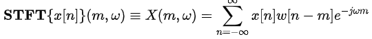 |
|:--:|
| *Credit: https://en.wikipedia.org/wiki/Short-time_Fourier_transform#Discrete-time_STFT* |

with signal x[n] and window w[n].

The magnitude squared of the STFT yields the spectrogram representation of the Power Spectral Density of the function:

| 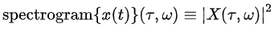 |
|:--:|
| *Credit: https://en.wikipedia.org/wiki/Short-time_Fourier_transform#Discrete-time_STFT* |

| 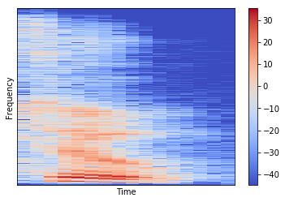 |
|:--:|
| Spectrogram Example |

> Although we use MFCCs in our project, it's also fine to use Spectrograms as inputs to our neural networks. To understand why we prefer MFCCs over Spectrograms, read the answers to the question, [What are the advantages of using spectrogram vs MFCC as feature extraction for speech recognition using deep neural network?](https://www.quora.com/What-are-the-advantages-of-using-spectrogram-vs-MFCC-as-feature-extraction-for-speech-recognition-using-deep-neural-network) on Quora.

 Mel-Frequency Cepstral Coefficient (MFCC) 

Up to this point, all the concepts we've covered in Signal Processing were focused on making it easier for the computer to process the data. But, let's not forget that we're training and evaluating our model on **Human speech** and not on computer-generated audio.

We want the machines to understand our way of perceiving things and not the other way around! This can be achieved by transforming input data to reflect human perception. But how is human perception different from a computer's perception?

Turns out that we humans perceive sound on a **logarithmic** scale! Most human beings can easily tell the difference between a 100 Hz and 200 Hz sound. By that same token, we should assume that we can tell the difference between 1000 and 1100 Hz, right? Wrong. It is actually much harder for humans to be able to differentiate between higher frequencies, and easier for lower frequencies. So, even though the distance between the two sets of sounds are the same, **our perception of the distance is not**. This is what makes the Mel Scale fundamental in Machine Learning applications to audio, as it mimics our own perception of sound. [[6](https://towardsdatascience.com/learning-from-audio-the-mel-scale-mel-spectrograms-and-mel-frequency-cepstral-coefficients-f5752b6324a8)]

The transformation from the Hertz scale to the Mel Scale is the following:

| 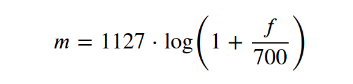 |
|:--:|
| *Credit: https://towardsdatascience.com/learning-from-audio-the-mel-scale-mel-spectrograms-and-mel-frequency-cepstral-coefficients-f5752b6324a8* |

Note that **log** in this case refers to the **natural logarithm** (also denoted as ln.)

We can visualize sounds on Mel Scale as opposed to the frequency domain and this spectrogram would be called Mel Spectrogram.

But, wait! What does "Cepstral" mean? Have we misspelled "Spectrum"?  
Lol. No!  
*A Cepstrum is a Spectrum of a Spectrum.*  

Read further.

The procedure for deriving MFCCs is as follows:
1. Take the Fourier transform of (a windowed excerpt of) a signal.
2. Map the powers of the spectrum obtained above onto the mel scale, using triangular overlapping windows or alternatively, cosine overlapping windows.
3. Take the logs of the powers at each of the mel frequencies.
4. Take the discrete cosine transform of the list of mel log powers, as if it were a signal.
5. The MFCCs are the amplitudes of the resulting spectrum.

| 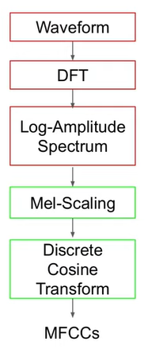 | 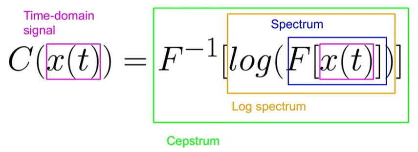 |
|:--:|:--:|
| *Credit: https://www.youtube.com/watch?v=4_SH2nfbQZ8* | *Credit: https://www.youtube.com/watch?v=4_SH2nfbQZ8* |

As we can see, computing MFCCs involves getting the spectrum of a (log) spectrum by applying the equivalent of an Inverse DFT (Discrete Cosine Transform) and that's why we use the word *Cepstral*!

By the way, the log spectrum is continuous and has some periodic structures (because the original signal has some harmonic components). Because of these properties, we can treat the log spectrum as a time-domain signal and apply a Fourier-Transform-like transformation (Inverse Fourier Transform, DCT) to understand which frequencies (Quefrency, measured in milliseconds) are present in the signal.

Whoa! Quefrency? Seriously? Another new term? So confusing, right? If you take the inverse of frequency, aren't you supposed to get time?  
Apparently not.  

> *The cepstrum starts by taking the Fourier transform, then the magnitude, then the logarithm, and then the inverse Fourier transform. When we take the magnitude, we throw away phase information, which we don’t need in this context. Taking the log of the magnitude is essentially what you do when you compute sound pressure level. Some define the cepstrum using the magnitude of the Fourier transform and some the magnitude squared. Squaring only introduces a multiple of 2 once we take logs, so it doesn’t effect the location of peaks, only their amplitude. Taking the logarithm compresses the peaks, bringing them all into roughly the same range, making the sequence of peaks roughly periodic. **When we take the inverse Fourier transform, we now have something like a frequency, but inverted. This is what Tukey called quefrency.*** - Read the whole article on [Cepstrum, quefrency, and pitch](https://www.johndcook.com/blog/2016/05/18/cepstrum-quefrency-and-pitch/)

With that out of the way, let's understand why we take the Discrete Cosine Transform.
- DCT gives us real-valued coefficients, while a Fourier Transform gives us Complex coefficients, which we don't need. 
- DCT decorrelates energy in different mel bands. In Machine Learning, we want features that are as decorrelated as possible.
- DCT reduces the number of dimensions we use to represent the spectrum. (DCT works as a dimensionality reduction algorithm)

For a deeper understanding, read answers to the following questions on stackexchange. (Click on each question below to expand answers.)

 How do I interpret the DCT step in the MFCC extraction process? 

You can think of the DCT as a compression step. Typically with MFCCs, you will take the DCT and then keep only the first few coefficients. This is basically the same reason that the DCT is used in JPEG compression. DCTs are chosen because their boundary conditions work better on these types of signals.

Let's contrast the DCT with the Fourier transform. The Fourier transform is made up of sinusoids that have an integer number of cycles. This means, all of the Fourier basis functions start and end at the same value -- they do not do a good job of representing signals that start and end at different values. Remember that the Fourier transform assumes a periodic extension: If you imagine your signal on a sheet of paper, the Fourier transform wants to roll that sheet into a cylinder so that the left and right sides meet.

Think of a spectrum that is shaped roughly like a line with negative slope (which is pretty typical). The Fourier transform will have to use a lot of different coefficients to fit this shape. On the other hand, the DCT has cosines with half-integer numbers of cycles. There is, for example, a DCT basis function that looks vaguely like that line with negative slope. It does not assume a period extension (instead, an even extension), so it will do a better job of fitting that shape.

So, let's put this together. Once you've computed the Mel-frequency spectrum, you have a representation of the spectrum that is sensitive in a way similar to how human hearing works. Some aspects of this shape are more relevant than others. Usually, the larger more overarching spectral shape is more important than the noisy fine details in the spectrum. You can imagine drawing a smooth line to follow the spectral shape, and that the smooth line you draw might tell you just about as much about the signal.

When you take the DCT and discard the higher coefficients, you are taking this spectral shape, and only keeping the parts that are more important for representing this smooth shape. If you used the Fourier transform, it wouldn't do such a good job of keeping the important information in the low coefficients.

If you think about feeding the MFCCs as features to a machine learning algorithm, these lower-order coefficients will make good features, since they represent some simple aspects of the spectral shape, while the higher-order coefficients that you discard are more noise-like and are not important to train on. Additionally, training on the Mel spectrum magnitudes themselves would probably not be as good because the particular amplitude at different frequencies are less important than the general shape of the spectrum.

 DCT step in MFCC process 

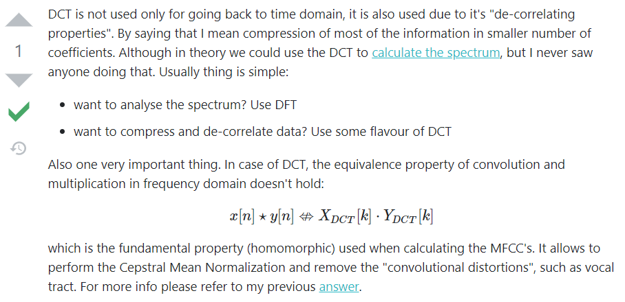

 Is this a correct interpretation of the DCT step in MFCC calculation? 

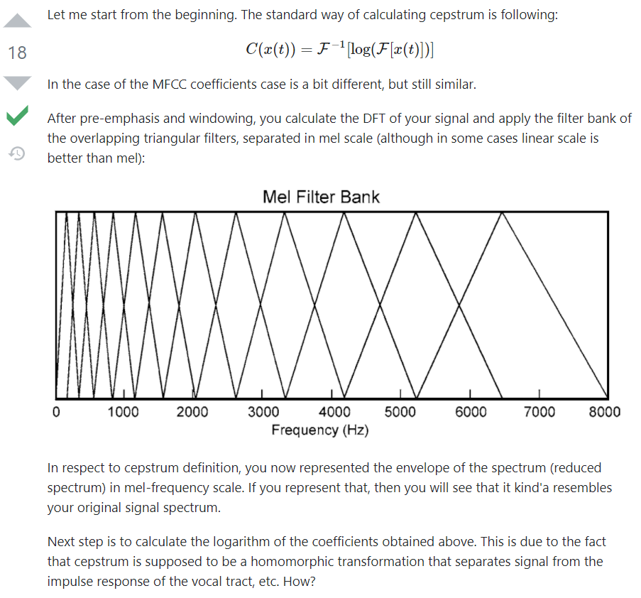
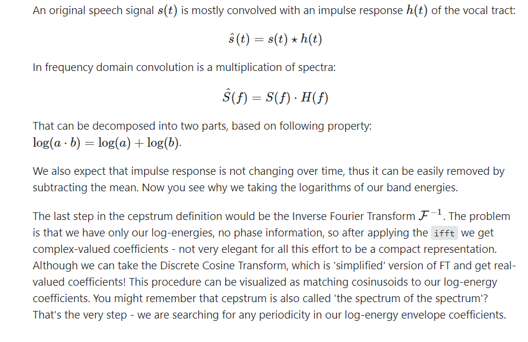
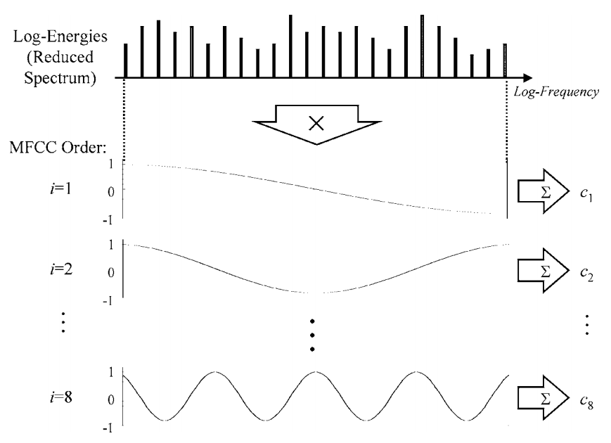
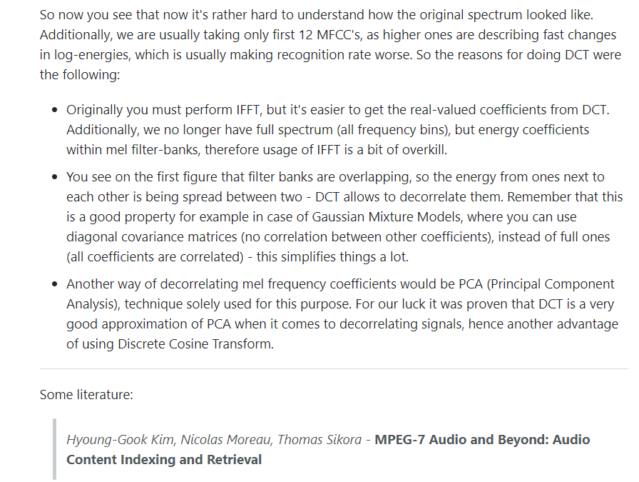

> MFCCs in Machine Learning.
> The number of MFCCs is a hyperparameter for us to tune.

> Traditionally, we take the first 12-13 coefficients. The first coefficients keep the most information (eg. formants, spectral envelope)

> Use &#x394; MFCCs and &#x394; &#x394; MFCCs. (first and second order derivatives)

> We'll get 39 coefficients per frame. (13 MFCCs + 13 &#x394; MFCCs + 13 &#x394; &#x394; MFCCs)

To recall, we use MFCCs to train our model on human-like audio features. They describe the "large" structures of the spectrum and ignore the fine spectral structures.

We've covered just enough Signal Processing to implement a basic Audio Classification pipeline. However, remember that Signal Processing is a huge subfield that covers many more concepts and mastering it requires rigourous and extensive study.  

[Signals and Systems by Alan V. Oppenheim, S. Hamid Nawab, Alan S. Willsky](https://www.goodreads.com/book/show/166327.Signals_and_Systems) and [Discrete-Time Signal Processing by Alan V. Oppenheim, Ronald W. Schafer, John R. Buck](https://www.goodreads.com/book/show/166325.Discrete_Time_Signal_Processing) would be a good place to start. All the best!

## Code

Code for the entire process can be found in [dl-for-speech-recognition.ipynb](https://github.com/koushikvikram/speech-recognition-deep-learning/blob/main/dl-for-speech-recognition.ipynb). 

The images below illustrate the process and outputs at each stage in the process.

|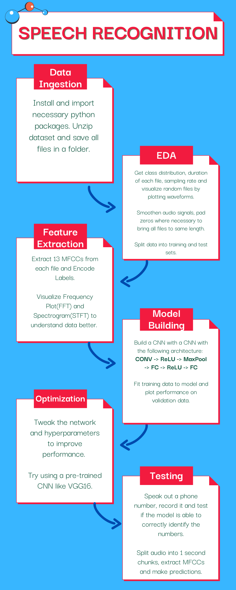 |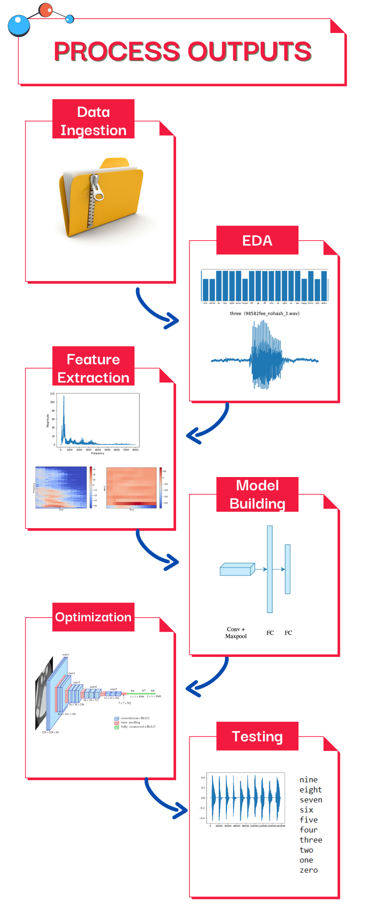|
|:--------------------------------------------------------------:|:--------------------------------------------------------------:|

Code is accompanied by comments and docstrings where necessary.

## Moving Forward

Now that you have a basic understanding of the Deep Learning workflow for Audio Classification and relevant Signal Processing concepts, you have quite a few options to consider. Deep Learning and Signal Processing are general concepts. While concepts like MFCCs are specific to human speech, the rest can be applied to any kind of digital signal data.

You could building more models or you could build your own IVR or you could even choose to build an Alexa skill. And, you can do it without writing a single line of code! Here's an example of an Alexa skill named *"FAANG Stock Tracker"* that I've created using [Voiceflow](https://www.voiceflow.com/).

| 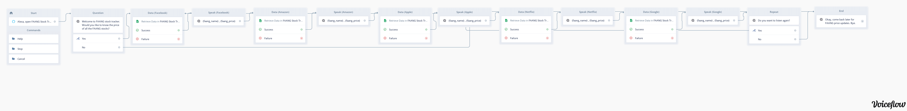 |
|:--:|
| Click image to enlarge |

Voiceflow is a WYSIWYG (What You See Is What You Get) tool. It allows you to create interactive voice apps by drag-and-drop. It provides components for User Input, Response, Logic and Integration with External Tools and Channels. You can also test your voice app and deploy it on multiple systems.

The following articles provide a more comprehensive overview of Voiceflow:
- [Exploring Voice User Interface Design — A Voiceflow Guide and Tutorial](https://medium.com/voice-experience-design/exploring-voice-user-interface-design-a-voiceflow-guide-and-tutorial-c51dd087d036)
- [Using Alexa and Voiceflow to prototype a telephone system](https://uxdesign.cc/using-alexa-and-voiceflow-to-prototype-a-telephone-system-539ab8b203fe)

Try them out and have fun!

## Conclusion

I hope this repo has given you enough confidence to begin your journey in the world of Audio Deep Learning. If you'd like to see additions, corrections or better explanations in this repo, please send an email with your feedback to koushikvikram91@gmail.com . I'd be more than happy to make improvements! 😊 

Thank you for your time! Make sure to check out my other repositories!

## Acknowledgment
1. [Speech Recognition And Customer Experience - C-Zentrix](https://www.c-zentrix.com/blog/speech-recognition-and-customer-experience)
2. [Speech Recognition - Wikipedia](https://en.wikipedia.org/wiki/Speech_recognition)
3. [Speech Commands Data Set v0.01](https://www.kaggle.com/c/tensorflow-speech-recognition-challenge/data)
4. [Nyquist Theorem - Science Direct](https://www.sciencedirect.com/topics/engineering/nyquist-theorem#:~:text=Nyquist's%20theorem%20states%20that%20a,higher%20than%20this%20is%20necessary.)
5. [Digital Audio Basics: Audio Sample Rate and Bit Depth](https://www.izotope.com/en/learn/digital-audio-basics-sample-rate-and-bit-depth.html)
6. [Learning from Audio: The Mel Scale, Mel Spectrograms, and Mel Frequency Cepstral Coefficients](https://towardsdatascience.com/learning-from-audio-the-mel-scale-mel-spectrograms-and-mel-frequency-cepstral-coefficients-f5752b6324a8)